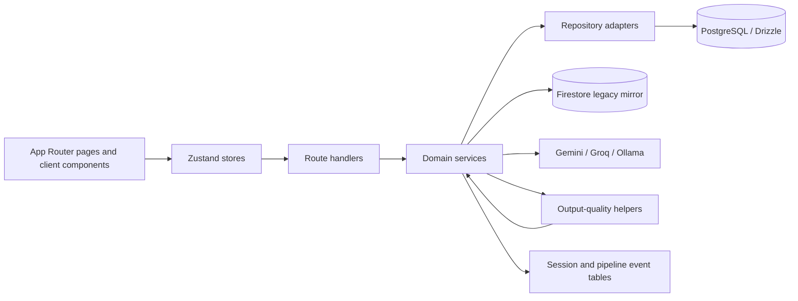
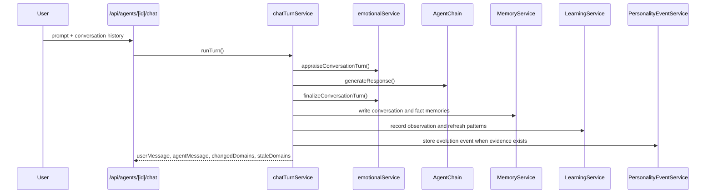
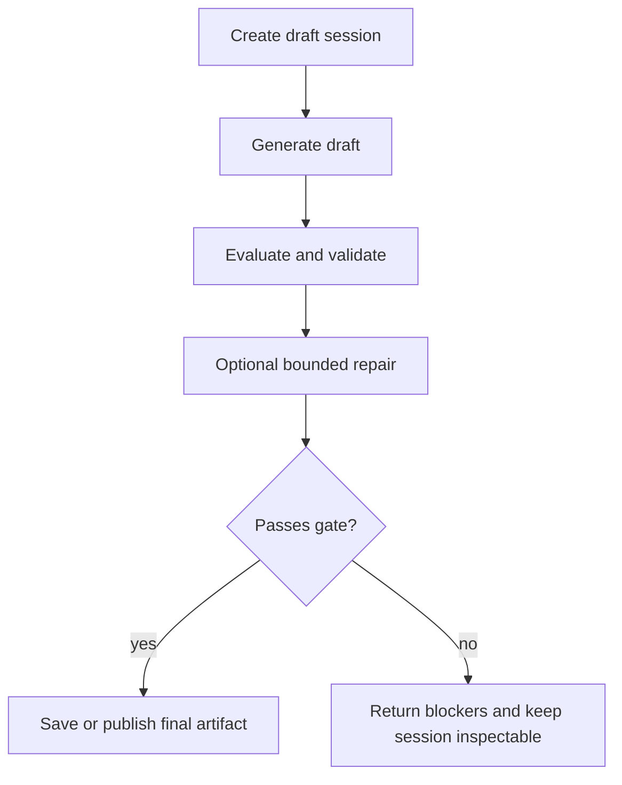

# Architecture

This project is a Next.js 15 App Router application with a split between presentation, orchestration, persistence, and LLM provider layers.

## System Map

The important rule is simple: UI renders state, routes validate and call services, services own behavior, and repositories only read or write rows.

## Runtime Layers

| Layer | Main folders | Responsibility |
| --- | --- | --- |
| UI | `src/app`, `src/components` | Pages, tabs, panels, navigation, and local interaction. |
| Client state | `src/stores` | Fetching, caching, and lightweight loading state. |
| Route handlers | `src/app/api` | Input validation, auth boundaries, serialization, and request routing. |
| Domain services | `src/lib/services` | Business logic, pipeline orchestration, scoring, and side effects. |
| Persistence | `src/lib/repositories`, `src/lib/db` | PostgreSQL access, schema, and persistence mode selection. |
| Provider integration | `src/lib/llm`, `src/lib/langchain` | Model selection, request building, prompt assembly, and fallback behavior. |
| Migration support | `scripts/`, `drizzle/` | Export, import, verification, cutover, and quality checks. |

## Persistence Modes

The runtime supports four modes:

| Mode | Reads | Writes | Notes |
| --- | --- | --- | --- |
| `firestore` | Firestore | Firestore | Legacy compatibility mode. |
| `dual-write-firestore-read` | Firestore | Firestore + PostgreSQL | Firestore is primary for reads. |
| `dual-write-postgres-read` | PostgreSQL | PostgreSQL + Firestore | PostgreSQL is primary for reads. |
| `postgres` | PostgreSQL | PostgreSQL | Canonical local and target runtime. |

`src/lib/db/persistence.ts` decides the mode from `PERSISTENCE_MODE` first, then falls back to `DATABASE_URL`.

## Cross-Cutting Rules

- Keep inspectable state in rows, not just in transient prompts.
- Keep session work split into draft, generate, evaluate, repair, and save/publish steps.
- Keep quality gates additive. Legacy rows should still read, but they may surface as `legacy_unvalidated`.
- Keep provider calls bounded and time-limited.
- Keep mirrored writes best-effort and queue failed mirrors in `migration_outbox`.

## Main Service Families

| Area | Key services | What they own |
| --- | --- | --- |
| Core agent state | `AgentService`, `agentStatsService`, `PersonalityService`, `emotionalService` | Agent records, defaults, trait movement, and emotion state. |
| Chat | `chatTurnService`, `MessageService`, `MemoryService`, `PersonalityEventService`, `LearningService` | Chat persistence, turn side effects, and prompt feedback loops. |
| Memory and knowledge | `memoryService`, `MemoryGraphService`, `knowledgeService` | Recall, semantic facts, and concept linking. |
| Relationships | `relationshipService`, `relationshipOrchestrator`, `conflictResolutionService` | Pair state, evidence, synthesis, and revision history. |
| Creative workspaces | `creativityService`, `dreamService`, `journalService` | Draft sessions, rubric evaluation, repair, and save/publish boundaries. |
| Analysis and planning | `profileAnalysisService`, `scenarioService`, `timelineService`, `metaLearningService` | Bounded runs, alternate branches, and narrative views. |
| Network features | `collectiveIntelligenceService`, `mentorshipService`, `challengeLabService`, `arenaService` | Shared knowledge, mentoring, challenge runs, and debates. |

## Core Diagrams

### Chat Turn

### Session-Based Workspaces

## Provider Selection

`src/lib/llm/provider.ts` resolves one provider per request. The order is:

1. Request preference from cookies or headers.
2. Environment preference.
3. First available provider from Gemini, Groq, then Ollama.

Requests are time-limited with an `AbortController`. If the provider fails or times out, the calling service should fall back to a bounded local error path instead of hanging the request.

## Detailed References

- [`runtime.md`](./runtime.md)
- [`../database/postgresql-schema.md`](../database/postgresql-schema.md)
- [`../database/firestore-to-postgres-mapping.md`](../database/firestore-to-postgres-mapping.md)
