# Data Model

PostgreSQL is the canonical runtime store. Firestore remains available for legacy reads, exports, and dual-write cutovers.

## Storage Principles

- Use text primary keys so Firestore IDs can be preserved.
- Keep timestamps as `timestamptz`.
- Keep variable payloads in `jsonb`.
- Keep query-critical fields indexed beside the payload.
- Keep inspectable history append-only where the product needs replay or explanation.

## Table Families

```mermaid
erDiagram
  agents ||--o{ messages : owns
  agents ||--o{ memories : owns
  agents ||--|| memory_graphs : summarizes
  agents ||--o{ agent_personality_events : evolves
  agents ||--o{ creative_sessions : runs
  creative_sessions ||--o{ creative_artifacts : produces
  creative_sessions ||--o{ creative_pipeline_events : logs
  agents ||--o{ dream_sessions : runs
  dream_sessions ||--o{ dreams : produces
  dream_sessions ||--o{ dream_pipeline_events : logs
  agents ||--o{ journal_sessions : runs
  journal_sessions ||--o{ journal_entries : produces
  journal_sessions ||--o{ journal_pipeline_events : logs
  agents ||--o{ profile_analysis_runs : runs
  profile_analysis_runs ||--o{ profile_interview_turns : records
  profile_analysis_runs ||--o{ profile_pipeline_events : logs
  agents ||--o{ learning_patterns : learns
  agents ||--o{ learning_goals : pursues
  agents ||--o{ learning_adaptations : applies
  agents ||--o{ learning_events : logs
  agents ||--o{ learning_observations : observes
  agents ||--o{ skill_progressions : tracks
```

## Core Tables

| Table | Role |
| --- | --- |
| `agents` | Canonical identity, persona, goals, counters, profiles, and active dream impression. |
| `messages` | Conversation turns and agent replies. |
| `memories` | Conversation memories and canonical semantic facts. |
| `memory_graphs` | Inspectable concept/link projection over memory rows. |
| `agent_personality_events` | Explainable dynamic trait changes. |
| `agent_relationships` | Fast projection of pair state. |
| `relationship_evidence` | Raw observations that support pair changes. |
| `relationship_revisions` | Applied long-term pair changes. |
| `relationship_synthesis_runs` | Each synthesis attempt and its output. |

## Session-Based Feature Tables

| Feature | Tables | Key notes |
| --- | --- | --- |
| Creative Studio | `creative_sessions`, `creative_artifacts`, `creative_pipeline_events` | Separate draft, artifact, and trace rows. |
| Profile analysis | `profile_analysis_runs`, `profile_interview_turns`, `profile_pipeline_events` | Transcript and pipeline events are persisted during the run. |
| Dream V2 | `dream_sessions`, `dreams`, `dream_pipeline_events` | Only saved dreams count toward archive and downstream behavior. |
| Journal V2 | `journal_sessions`, `journal_entries`, `journal_pipeline_events` | Saved entries are the only archive-visible results. |

## Learning Tables

| Table | Role |
| --- | --- |
| `learning_patterns` | Confirmed repeated behavior patterns. |
| `learning_goals` | Structured learning objectives. |
| `learning_adaptations` | Active prompt-time or behavior adaptations. |
| `learning_events` | Meta-learning activity log. |
| `learning_observations` | Per-turn observations and follow-up resolution state. |
| `skill_progressions` | Persistent skill progress records. |
| `agent_rate_limits` | Per-agent feature rate limiting state. |

## Social And Network Tables

| Table | Role |
| --- | --- |
| `shared_knowledge` | Shared conclusions or insights. |
| `collective_broadcasts` | Broadcast records tied to shared knowledge. |
| `conflicts` | Stored conflict analyses and resolution state. |
| `challenge_runs` | Challenge Lab run state and quality metadata. |
| `challenge_events` | Append-only challenge event feed. |
| `challenge_participant_results` | Per-agent challenge outcomes. |
| `mentorships` | Mentorship relationships and progress. |
| `arena_runs` | Sandbox debate run state. |
| `arena_events` | Append-only arena event feed. |
| `simulations` | Legacy compatibility table for old simulation records. |
| `scenario_runs` | What-if branch experiments. |

## Migration And Safety Tables

| Table | Role |
| --- | --- |
| `migration_outbox` | Failed mirrored writes and retry metadata. |

## Special Field Rules

### `agents`

- `memoryCount`, `totalInteractions`, `relationshipCount`, `creativeWorks`, `dreamCount`, `journalCount`, `challengesCompleted`, and `challengeWins` are server-side counters.
- `emotionalState`, `emotionalHistory`, `emotionalProfile`, and `psychologicalProfile` are derived state and should not be treated as independent user input.
- `activeDreamImpression` is the bounded residue from the latest saved dream.

### `memories`

- Conversation episodes and canonical facts share the same table.
- Canonical semantic memory fields are `canonicalKey`, `canonicalValue`, `confidence`, `evidenceRefs`, `supersedes`, and `lastConfirmedAt`.
- `origin` keeps the source path visible.

### Session Tables

The session tables all carry a similar set of fields:

- `status`
- `qualityStatus`
- `repairCount`
- `promptVersion`
- `provider`
- `model`
- `failureReason`
- `createdAt`
- `updatedAt`
- `payload`

That shape keeps generated work inspectable across products.

## Quality And Legacy States

Several tables carry additive quality fields:

- `quality_status`
- `normalization_status`
- `quality_score`
- `repair_count`
- `prompt_version`

When data predates the upgraded contract, the UI should treat it as `legacy_unvalidated` rather than pretending it passed the current gate.

## Firestore Compatibility

Firestore still matters for:

- export and import
- local cutover workflows
- dual-write mirroring
- legacy reads during migration windows

`src/lib/persistence/writeMirror.ts` uses best-effort mirrored writes and enqueues outbox rows when the secondary write fails.

## Detailed References

- [`../database/postgresql-schema.md`](../database/postgresql-schema.md)
- [`../database/firestore-to-postgres-mapping.md`](../database/firestore-to-postgres-mapping.md)
- [`../database/cutover-runbook.md`](../database/cutover-runbook.md)

