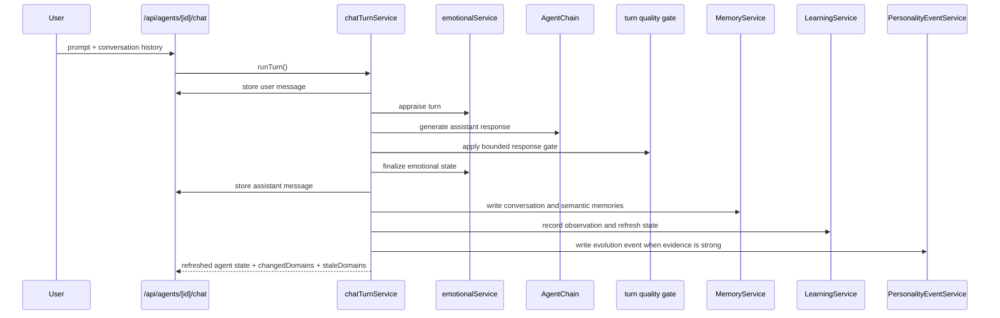

# Chat

## Purpose

Chat is the main live interaction path. It is the canonical write point for:

- messages
- memory writes
- emotional updates
- learning observations
- personality evidence
- prompt-time feedback metadata

It answers the question:

`What happened in this turn, and what changed because of it?`

## UI Entry Point

- `/agents/[id]` on the Chat tab

## API Route

- `POST /api/agents/[id]/chat`

## Ownership

- Route: `src/app/api/agents/[id]/chat/route.ts`
- Service: `src/lib/services/chatTurnService.ts`
- LLM chain: `src/lib/langchain/agentChain.ts`
- Message persistence: `src/lib/services/messageService.ts`
- Memory persistence: `src/lib/services/memoryService.ts`
- Emotion orchestration: `src/lib/services/emotionalService.ts`
- Learning orchestration: `src/lib/services/learningService.ts`
- Personality evidence: `src/lib/services/personalityEventService.ts`
- Dream residue: `src/lib/services/dreamService.ts`
- Quality gate: `src/lib/services/outputQuality/chatTurnQuality.ts`

## Turn Sequence

## Detailed Workflow

1. The user submits a prompt.
2. The route validates that the prompt is present.
3. The service stores the user message first.
4. Emotion appraisal runs against:
   - current agent state
   - prompt text
   - recent message history
5. The agent chain builds the response using:
   - memory context
   - emotional context
   - learning adaptations
   - optional dream residue
   - provider/model preference
6. The output-quality gate can repair the response once if it fails the turn-level rules.
7. The assistant message is stored with rich metadata.
8. A conversation memory is written.
9. Structured semantic facts are extracted and upserted.
10. The memory graph is refreshed.
11. Learning observations and patterns are updated.
12. Personality evidence is analyzed.
13. The service returns the changed and stale domains so the UI can refresh only the affected tabs.

## Message Metadata

The assistant message may include:

- `reasoning`
- `toolsUsed`
- `memoryUsed`
- `model`
- `provider`
- `responseQuality`
- `emotionSummary`
- `emotionEvents`
- `dreamImpression`

That metadata is the inspectable record of what the model did and what the post-processing pipeline changed.

## Memory Behavior

Chat writes two broad types of memories:

- `conversation_episode`: a compact record of the exchange
- semantic memory rows: stable facts, preferences, projects, tensions, relationships, and other canonical recall items

Semantic memories are preferred over raw transcript memory when the system needs a stable fact later.

## Learning Behavior

Each chat turn can update the learning system in a few steps:

- record the observation
- resolve a previous pending observation if the new prompt answers it
- confirm patterns when evidence repeats
- create or update active adaptations
- feed those adaptations back into later prompts

That keeps learning from becoming a hidden side effect.

## Personality Behavior

The personality system looks for evidence in the response, not just the user message.

It cares about:

- empathy
- structured guidance
- topic retention
- confidence
- adaptability

This prevents the agent from being punished for a difficult user message when the response itself was strong.

## Failure Modes

- No provider configured
- Provider timeout
- Malformed provider payload
- Output-quality gate failure
- Agent missing from route

In failure cases, the service returns a bounded fallback response instead of dropping the whole turn.

## Related Files

- [`src/lib/services/chatTurnService.ts`](../../../src/lib/services/chatTurnService.ts)
- [`src/lib/services/memoryService.ts`](../../../src/lib/services/memoryService.ts)
- [`src/lib/services/learningService.ts`](../../../src/lib/services/learningService.ts)
- [`src/lib/services/emotionalService.ts`](../../../src/lib/services/emotionalService.ts)
- [`src/lib/services/personalityService.ts`](../../../src/lib/services/personalityService.ts)

