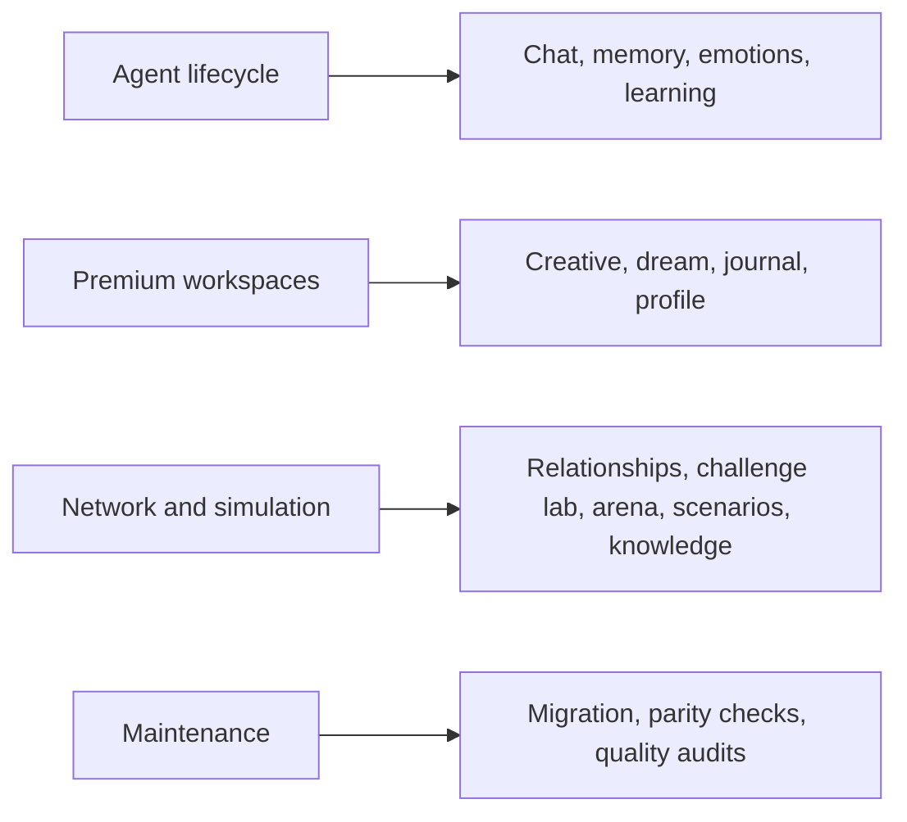

# Workflows

This section explains what actually happens when a user or system triggers the main product flows.

## Workflow Families

The main design rule is the same everywhere: keep the steps inspectable, keep the final state explicit, and keep failure states machine-readable.

## Main Documents

- [`agent-lifecycle.md`](./agent-lifecycle.md)
- [`premium-workspaces.md`](./premium-workspaces.md)

## Shared Pattern

Most workflows follow this structure:

1. Create or load a draft or bootstrap record.
2. Assemble bounded context.
3. Run the provider-backed generation or analysis step.
4. Persist stage events while the run is active.
5. Validate and evaluate the result.
6. Run one bounded repair pass when needed.
7. Save or publish only from a passing final state.

That pattern appears in creative, dream, journal, profile, scenario, challenge, and arena flows. Chat is the main exception because it is a turn-by-turn interaction rather than a draft-session workflow.
