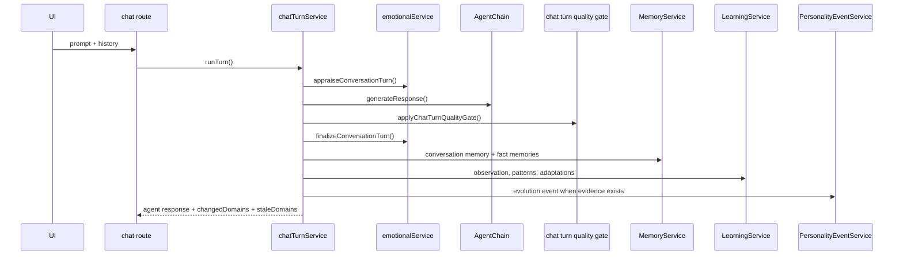

# Agent Lifecycle

This document covers the flows that happen around an individual agent: creation, chat, memory, emotion, learning, profile movement, and selective UI refresh.

## 1. Create A New Agent

### Entry Points

- `/agents/new`
- `POST /api/agents`

### What Happens

1. The user submits a name, persona, goals, and optional settings.
2. `AgentService.createAgent()` derives:
   - initial core personality
   - linguistic profile
   - emotional profile
   - dormant emotional state
   - default stats
   - initial psychological profile
3. The agent record is stored.
4. The UI returns to the roster or agent detail page.

### Persistence

- `agents`

### Important Notes

- Creation does not create messages, memories, or evolution events.
- The emotional state starts dormant, not active.
- The server, not the client, creates counters and derived profiles.

## 2. Chat Turn

### Entry Points

- `/agents/[id]`
- `POST /api/agents/[id]/chat`

### Sequence

### Detailed Steps

1. The user message is stored first.
2. The emotion system appraises the user message against the agent state and recent context.
3. The agent chain generates a response with memory, emotion, learning, and optional dream residue in the prompt context.
4. The output-quality gate may repair the response once if it misses the turn-level rules.
5. The assistant message is stored with metadata for reasoning, tools, model, provider, and quality repair details.
6. A conversation memory is written.
7. Structured fact memories are extracted and upserted.
8. The memory graph is refreshed when semantic memories change.
9. Learning observations, patterns, goals, and adaptations are refreshed.
10. Personality evidence is analyzed and stored when the evidence is strong enough.
11. The route returns `changedDomains` and `staleDomains` so the UI can refresh only the affected tabs.

### Side Effects

- `messages`
- `memories`
- `memory_graphs`
- `learning_observations`
- `learning_patterns`
- `learning_goals`
- `learning_adaptations`
- `agent_personality_events`
- `agents.emotional_state`
- `agents.emotional_history`
- `agents.stats`
- `agents.total_interactions`
- `agents.memory_count`

### Important Metadata

The assistant message can include:

- reasoning text
- tools used
- memory used
- provider and model
- quality repair metadata
- emotion summary
- emotion event summaries
- active dream impression metadata when present

## 3. Memory Recall And Deletion

### Entry Points

- `GET /api/agents/[id]/memories`
- `GET /api/agents/[id]/memories/stats`
- `POST /api/agents/[id]/memories/recall`
- `DELETE /api/agents/[id]/memories/[memoryId]`
- `GET|POST /api/memory`

### Rules

- Conversation memories capture raw interaction history.
- Fact memories capture stable facts such as identity, project, and preference.
- Semantic memory types are scored higher in recall and used as canonical prompt context.
- Deletes are server-side operations and must keep `agents.memory_count` in sync.

### Recall Behavior

Recall is heuristic ranking, not pure vector search. It scores:

- keyword overlap
- summary overlap
- content overlap
- context overlap
- importance
- semantic memory bonus

## 4. Emotion Updates

The emotion system operates on two levels:

- appraisal during the chat turn
- finalization after the assistant response exists

It can also update mood during internal actions such as creative generation, dream generation, and journal actions.

The stored emotional history is bounded and ordered so the UI can show the recent shifts without becoming noisy.

## 5. Learning Loop

Learning now runs from actual conversation evidence. The sequence is:

1. capture a `learning_observation`
2. resolve the previous pending observation if new evidence answers it
3. confirm repeated patterns
4. promote patterns into adaptations
5. feed active adaptations back into later prompt assembly

This keeps learning inspectable and prevents the agent from silently changing behavior without a record.

## 6. Profile Movement

Dynamic trait changes are intentionally small.

The system looks for evidence of:

- empathy
- structured guidance
- topic retention
- confidence
- adaptability

When the evidence is strong enough, it writes an evolution event and updates the agent record slowly. The deep psychological profile is not regenerated on every chat turn.

## 7. Timeline Refresh

The timeline workspace is query-time derived from existing feature tables. The chat turn can make events visible in the timeline, but the timeline itself is not a separate source of truth.

## 8. Failure Behavior

Chat must degrade cleanly when something fails:

- missing provider
- provider timeout
- malformed provider response
- quality gate failure

When generation fails, the system falls back to a bounded response rather than dropping the request.

