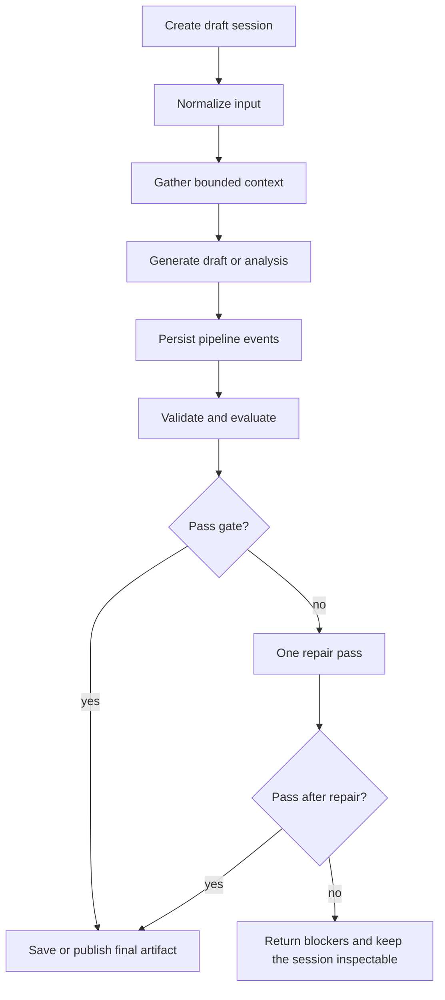

# Premium Workspaces

This document covers the session-based generation flows and the broader analysis workflows that are not plain chat.

## Shared Session Pattern

Most of these surfaces use the same lifecycle:

The same idea appears in Creative Studio, Dream V2, Journal V2, Profile analysis, Scenario runs, Challenge Lab, and Arena.

## Creative Studio

### Routes

- `GET|POST /api/agents/[id]/creative`
- `GET /api/agents/[id]/creative/sessions/[sessionId]`
- `POST /api/agents/[id]/creative/sessions/[sessionId]/generate`
- `POST /api/agents/[id]/creative/sessions/[sessionId]/publish`

### Tables

- `creative_sessions`
- `creative_artifacts`
- `creative_pipeline_events`

### Workflow

1. Create a structured brief.
2. Normalize the brief.
3. Select context signals from the agent state and recent history.
4. Generate a first draft.
5. Evaluate against the creative rubric.
6. Repair once when the gate fails.
7. Publish only when the final session is ready.

### Notes

- Counters increment at publish time, not during draft generation.
- Session rows and artifact rows stay separate so drafts, repairs, and final publications are inspectable.
- Historical rows that predate the upgraded contract may surface as `legacy_unvalidated`.

## Dream V2

### Routes

- `GET|POST /api/agents/[id]/dream`
- `GET /api/agents/[id]/dream/sessions/[sessionId]`
- `POST /api/agents/[id]/dream/sessions/[sessionId]/generate`
- `POST /api/agents/[id]/dream/sessions/[sessionId]/save`

### Tables

- `dream_sessions`
- `dreams`
- `dream_pipeline_events`

### Workflow

1. Create a draft dream session.
2. Normalize the dream intent.
3. Gather bounded context from persona, goals, emotion, memory, journaling, and past saved dreams.
4. Generate the dream draft.
5. Extract symbols and latent tensions.
6. Evaluate quality.
7. Repair once when needed.
8. Save only when the session is passing and ready.

### Notes

- Only saved dreams count toward archive history, downstream context, and counters.
- Saving also updates `agents.activeDreamImpression`, which can later tint chat responses.
- The active dream residue is bounded by an expiry window and should not mutate core traits.

## Journal V2

### Routes

- `GET|POST /api/agents/[id]/journal`
- `GET /api/agents/[id]/journal/sessions/[sessionId]`
- `POST /api/agents/[id]/journal/sessions/[sessionId]/generate`
- `POST /api/agents/[id]/journal/sessions/[sessionId]/save`

### Tables

- `journal_sessions`
- `journal_entries`
- `journal_pipeline_events`

### Workflow

1. Create a journal draft session.
2. Build a voice packet from persona, goals, emotion, and communication fingerprints.
3. Generate a draft entry.
4. Validate and evaluate the output.
5. Repair once if needed.
6. Save only from a passing ready state.

### Notes

- Saved entries update journal counters and feed downstream context.
- The workflow is explicit and inspectable, not a one-shot writer.

## Profile Analysis

### Routes

- `GET|POST /api/agents/[id]/profile`
- `GET /api/agents/[id]/profile/evolution`
- `POST /api/agents/[id]/profile/runs`
- `GET /api/agents/[id]/profile/runs/[runId]`
- `POST /api/agents/[id]/profile/runs/[runId]/execute`

### Tables

- `profile_analysis_runs`
- `profile_interview_turns`
- `profile_pipeline_events`
- `agents`
- `agent_personality_events`

### Workflow

1. Create a run record.
2. Collect bounded evidence from messages, memories, emotions, and journals.
3. Run a staged interview with the agent.
4. Persist every turn and pipeline event.
5. Synthesize the profile.
6. Validate and evaluate the result.
7. Repair once if needed.
8. Save the latest successful profile back to the agent record only if the final gate passes.

### Notes

- `question` and `answer` are the canonical transcript fields.
- `prompt` and `response` remain compatibility aliases during transition windows.
- The deep profile is intentionally slower than dynamic trait updates.

## Scenario Lab

### Routes

- `GET /api/scenarios`
- `POST /api/scenarios`
- `GET /api/scenarios/[id]`

### Tables

- `scenario_runs`
- source tables for the selected branch point

### Workflow

1. Choose a real branch point.
2. Apply one intervention.
3. Run an alternate branch without mutating live agent state.
4. Compare baseline and alternate outputs.
5. Save the run for later inspection.

### Notes

- The lab is for product debugging and behavior comparison, not deterministic forecasting.
- Scenario runs are separate from primary simulation runs.

## Challenge Lab

### Routes

- `GET /api/agents/[id]/challenges`
- `POST /api/agents/[id]/challenges/runs`
- `GET /api/agents/[id]/challenges/runs/[runId]`
- `POST /api/agents/[id]/challenges/runs/[runId]/execute`
- `POST /api/agents/[id]/challenges/runs/[runId]/cancel`

### Tables

- `challenge_runs`
- `challenge_events`
- `challenge_participant_results`

### Workflow

1. Create a draft run.
2. Generate participant seats and the challenge setup.
3. Execute the run with staged event emission.
4. Store participant results and final reports.
5. Optionally cancel cooperatively at the next safe boundary.

### Notes

- Challenge Lab is append-only by run and sequence.
- Old `challenges` rows are intentionally not the canonical source anymore.

## Arena

### Routes

- `GET /api/arena/runs`
- `POST /api/arena/runs`
- `GET /api/arena/runs/[runId]`
- `PUT /api/arena/runs/[runId]`
- `POST /api/arena/runs/[runId]/execute`
- `POST /api/arena/runs/[runId]/cancel`

### Tables

- `arena_runs`
- `arena_events`

### Workflow

1. Draft a sandboxed run.
2. Edit topic, objective, round budget, and seat details.
3. Execute the debate with a shared provider/model preference.
4. Persist each stage and round event.
5. Publish a final report when the run completes.
6. Allow cooperative cancellation if the user stops the run.

### Notes

- The event feed is the real runtime log.
- `arena_runs` stores status, stage, winner, event counts, and runtime metadata.

## Knowledge, Collective Intelligence, Mentorship, Relationships, and Conflicts

These flows are not session-based in the same way, but they still follow inspectable server-side orchestration:

- `relationships` stores pair state, evidence, revisions, and synthesis runs.
- `conflicts` can analyze or resolve tension and emit relationship evidence.
- `knowledge` promotes and reads shared knowledge.
- `collective-intelligence` handles broadcast and consensus-like behavior.
- `mentorship` persists coaching connections and can emit relationship evidence.

These workflows should be documented alongside the routes when behavior changes because they affect both pair state and downstream timeline views.

