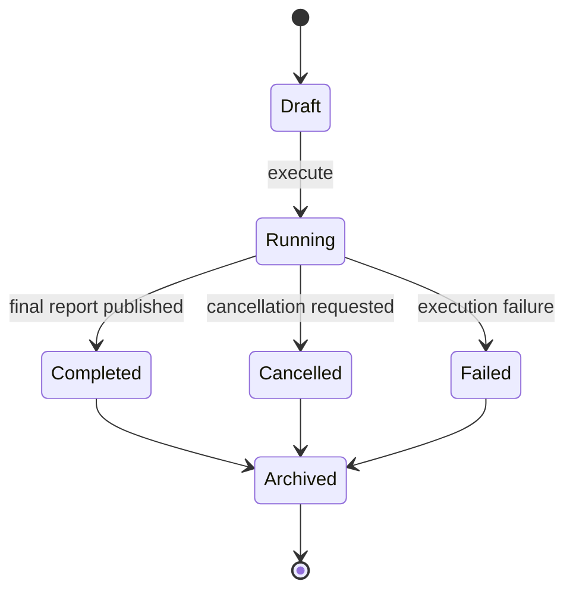

# Arena

## 1. Purpose and user intent

The Arena workspace at `/simulation` runs structured multi-agent debates. It supports draft preparation, seat planning, live execution, scoring, final report publication, and event-by-event replay.

## 2. UI entry points and key controls

- Entry point: `src/app/simulation/page.tsx`.
- Key controls:
  - topic and objective inputs
  - participant selection
  - round count selector
  - response budget selector
  - seat overrides
  - prepare, save, launch, refresh, and cancel actions
  - archived-run picker and event expansion
- The selected LLM provider is sent through the same client preference headers used by the workspace tabs.

## 3. End-to-end user workflow

1. Open `/simulation`.
2. The page loads run summaries through `GET /api/arena/runs?limit=10`.
3. The user creates a draft run with `POST /api/arena/runs`.
4. The UI loads run detail through `GET /api/arena/runs/[runId]`.
5. The user edits topic, objective, seats, or budget through `PUT /api/arena/runs/[runId]`.
6. The user launches execution with `POST /api/arena/runs/[runId]/execute`.
7. The UI polls detail, renders events by round, and shows scorecards and head directives.
8. The user can cancel via `POST /api/arena/runs/[runId]/cancel`.

## 4. Backend workflow/pipeline

1. `arenaService.createRun` validates participant count and round count and creates seat assignments.
2. Seat archetypes and alignment tags are derived from participant order and count.
3. `executeRun` steps through stage transitions such as preparation, directives, debater turns, score updates, summaries, and final report.
4. Events are written through `ArenaRepository.saveEvent` or Firestore store helpers.
5. The run row is updated through `ArenaRepository.upsertRun` after each stage.
6. Final report generation selects a winner and decisive moments.
7. Relationship side effects can flow from the completed arena through `relationshipOrchestrator` in downstream features.

## 5. API contract details

- `GET /api/arena/runs`
  - query `limit`; clamped between 1 and 24 by the route.
  - returns `{ runs: ArenaRunSummary[] }`.
- `POST /api/arena/runs`
  - body fields:
    - `topic`
    - `objective`
    - `participantIds`
    - `roundCount`
    - `responseBudget`
    - `referenceBrief`
    - `seatOverrides`
  - returns run detail with `201`.
- `GET /api/arena/runs/[runId]`
  - returns `{ run, events }`.
- `PUT /api/arena/runs/[runId]`
  - updates topic, objective, rounds, budget, brief, and seats.
- `POST /api/arena/runs/[runId]/execute`
  - executes a draft run with the selected provider.
- `POST /api/arena/runs/[runId]/cancel`
  - marks cancellation requested and returns updated detail.
- Edge cases:
  - round count is clamped to the service’s `MIN_ARENA_ROUNDS` and `MAX_ARENA_ROUNDS`.
  - participant count is constrained between 2 and 4.

## 6. Data model mapping

- Tables:
  - `arena_runs`
  - `arena_events`
- Run fields:
  - `status`, `latestStage`, `participantIds`, `sandboxed`, `cancellationRequested`, `roundCount`, `currentRound`, `eventCount`, `winnerAgentId`, `provider`, `model`, `failureReason`, `completedAt`, `payload`
- Event fields:
  - `sequence`, `stage`, `kind`, `speakerType`, `speakerAgentId`, `round`, `payload`
- The run payload stores:
  - config
  - participants
  - seats
  - scorecard snapshot
  - round ledger
  - final report

## 7. State transitions/lifecycle

## 8. Quality gates/validation rules

- Participant count must be between 2 and 4.
- Round count is clamped to the supported range.
- Response budget is normalized to `tight`, `balanced`, or `expanded`.
- Seat and move leakage patterns are scrubbed to reduce role leakage in generated turns.

## 9. Failure modes and how they surface in UI/API

- Invalid draft inputs: create or update fails with `500` and a service message.
- Run not found: detail route returns `404`.
- Mid-run provider failure: the run persists with `status: failed` and a `failureReason`.
- Polling or detail failure: the UI shows `uiError` while keeping already-loaded state when possible.

## 10. Debugging runbook

1. Inspect `arena_runs` for status, stage, and failure reason.
2. Inspect ordered `arena_events` for the last successful sequence.
3. Check seat configuration and alignment tags in the run payload when debate roles feel wrong.
4. Inspect the final report payload if winner selection looks inconsistent.
5. If relationship follow-on work is wrong, inspect the source arena run ID and downstream consumer logic.

## 11. Operational checklist

- Verify list, create, update, execute, poll, and cancel all work.
- Verify event ordering is stable.
- Verify scorecards update over rounds.
- Verify final report includes winner, decisive moments, and unresolved questions.

## 12. How to extend safely

- Preserve draft-versus-running separation; mutable seat edits should stay on draft runs only.
- If you add event kinds, update both `EVENT_KIND_META` in the page and backend event emitters.
- Keep run payloads inspectable; do not collapse the ledger into opaque text.

## 13. Code references

- `src/app/simulation/page.tsx`
- `src/app/api/arena/runs/route.ts`
- `src/app/api/arena/runs/[runId]/route.ts`
- `src/app/api/arena/runs/[runId]/execute/route.ts`
- `src/app/api/arena/runs/[runId]/cancel/route.ts`
- `src/lib/services/arenaService.ts`
- `src/lib/repositories/arenaRepository.ts`
- `src/lib/db/schema.ts`
