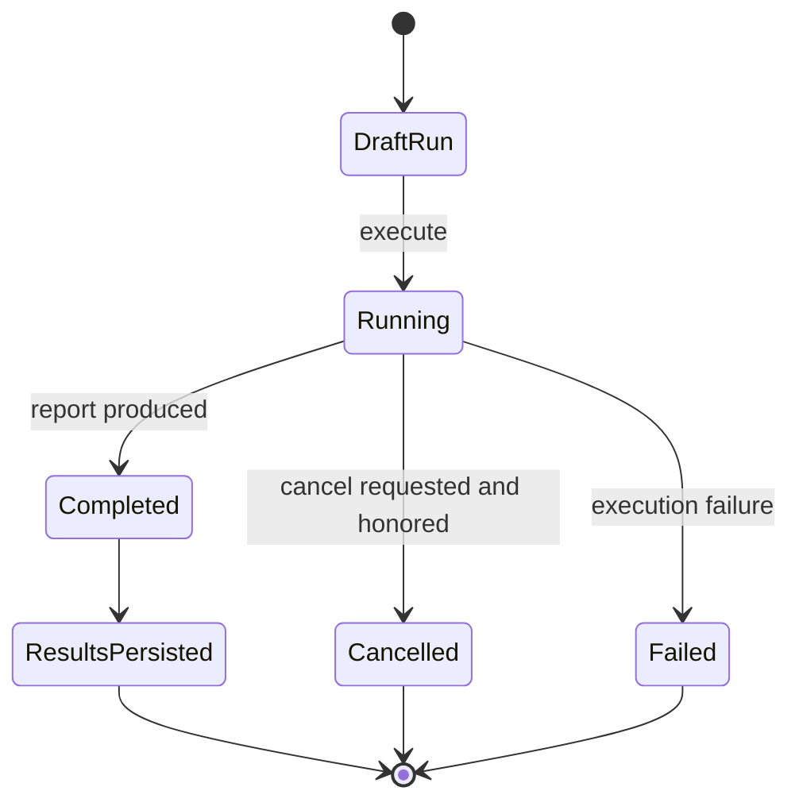

# Challenges

## 1. Purpose and user intent

The Challenges tab is the operational evaluation lab for solo capability tests, pair trials, and arena follow-up proofs. It is where the team can run bounded scenarios, score participants, and optionally emit relationship evidence from the result.

## 2. UI entry points and key controls

- Entry point: `ChallengeLab` in `src/components/challenges/ChallengeLab.tsx`.
- Key controls:
  - template picker
  - participant selector
  - scenario textarea
  - source arena run and event selection for follow-up proofs
  - execution budget selector
  - run create, execute, cancel, and detail/archive views

## 3. End-to-end user workflow

1. Open the Challenges tab.
2. `GET /api/agents/[id]/challenges` returns templates, recommendations, run history, and active-run context.
3. The user composes a new run and submits `POST /api/agents/[id]/challenges/runs`.
4. The user executes the run through `POST /api/agents/[id]/challenges/runs/[runId]/execute`.
5. The UI polls `GET /api/agents/[id]/challenges/runs/[runId]` while the run is active.
6. The run may be cancelled through `POST /api/agents/[id]/challenges/runs/[runId]/cancel`.
7. After completion, the UI shows event transcript, participant results, and any relationship signal synthesis.

## 4. Backend workflow/pipeline

1. `challengeLabService.bootstrap` loads templates, history, arena follow-up candidates, and any active run.
2. `createRun` validates template/participant counts, captures scenario and source metadata, and persists a draft `ChallengeRun`.
3. `executeRun` assigns role packets, prepares context, generates turn outputs, evaluates them, and builds a report.
4. `ChallengeLabRepository` or Firestore compatibility writers persist the run, event stream, and participant results.
5. If the template carries relationship signals, `relationshipOrchestrator` can synthesize pair evidence from the run report.
6. Agent progress counters such as challenge totals and wins are updated as side effects.

## 5. API contract details

- `GET /api/agents/[id]/challenges`
  - returns `ChallengeLabBootstrap`.
  - `404` if the agent is missing.
- `POST /api/agents/[id]/challenges/runs`
  - body fields:
    - `templateId` required
    - `participantIds` required
    - optional `scenario`, `sourceArenaRunId`, `sourceEventIds`, `executionBudget`
  - returns run detail with `201`
  - returns `400` when validation fails
- `GET /api/agents/[id]/challenges/runs/[runId]`
  - returns `ChallengeRunDetail`
  - `404` if missing
- `POST /api/agents/[id]/challenges/runs/[runId]/execute`
  - returns updated detail
- `POST /api/agents/[id]/challenges/runs/[runId]/cancel`
  - returns updated detail
- Edge cases:
  - the execute route can return `500` after partial progress; inspect persisted events.
  - pair templates enforce participant count bounds from the template metadata.

## 6. Data model mapping

- Tables:
  - `challenge_runs`
  - `challenge_events`
  - `challenge_participant_results`
  - `agents.challengesCompleted`
  - `agents.challengeWins`
- Run fields:
  - `primaryAgentId`, `mode`, `templateId`, `status`, `latestStage`, `participantIds`, `eventCount`, `qualityStatus`, `qualityScore`, `winnerAgentId`, `provider`, `model`, `failureReason`, `cancellationRequested`
- Event fields:
  - `sequence`, `stage`, `kind`, `speakerType`, `speakerAgentId`, `payload`
- Result fields:
  - `agentId`, `templateId`, `mode`, `outcome`, `totalScore`, `capabilityScore`, `relationshipScore`, `payload`

## 7. State transitions/lifecycle

## 8. Quality gates/validation rules

- Template selection must match participant count constraints.
- Run output is normalized and leakage-checked before scoring.
- Execution budgets are constrained to known values such as `fast` or `deep`.
- Relationship signal synthesis only runs for templates that define `relationshipSignals`.

## 9. Failure modes and how they surface in UI/API

- Invalid template or participant configuration: `400` on create.
- Missing run: `404` on detail.
- Partial execution failure: run persists with `failureReason` and a failing `latestStage`.
- Polling hiccup: UI keeps the last detail and warns rather than clearing the run.

## 10. Debugging runbook

1. Inspect `challenge_runs` for status, stage, and failure reason.
2. Inspect ordered `challenge_events` to see the last successful step.
3. Inspect `challenge_participant_results` when scoring looks wrong.
4. If the run came from arena follow-up, inspect linked arena run and event IDs.
5. If relationship changes are missing, trace the orchestrator call from the completed challenge report.

## 11. Operational checklist

- Verify bootstrap loads templates and history.
- Verify create, execute, poll, and cancel all work.
- Verify result scorecards and winner selection persist.
- Verify challenge counters and relationship side effects update when expected.

## 12. How to extend safely

- Add new templates in `CHALLENGE_TEMPLATES` with explicit participant bounds and scoring focus.
- Keep run, event, and result persistence in sync when you change stages.
- Do not bypass the repository by writing ad hoc challenge payloads directly.

## 13. Code references

- `src/app/api/agents/[id]/challenges/route.ts`
- `src/app/api/agents/[id]/challenges/runs/route.ts`
- `src/app/api/agents/[id]/challenges/runs/[runId]/route.ts`
- `src/app/api/agents/[id]/challenges/runs/[runId]/execute/route.ts`
- `src/app/api/agents/[id]/challenges/runs/[runId]/cancel/route.ts`
- `src/lib/services/challengeLabService.ts`
- `src/lib/repositories/challengeLabRepository.ts`
- `src/components/challenges/ChallengeLab.tsx`
- `src/lib/db/schema.ts`
