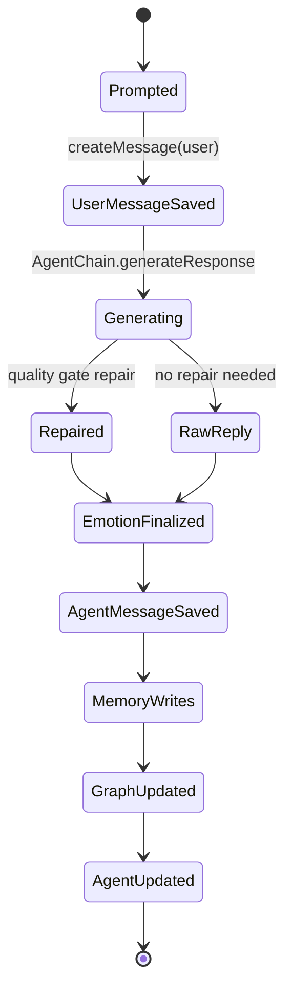

# Chat

## 1. Purpose and user intent

The Chat tab is the main interaction loop for an agent. A user sends a prompt, gets a model response, and implicitly updates message history, emotional state, memory, learning observations, and sometimes personality drift.

## 2. UI entry points and key controls

- Entry point: `chat` tab in `src/app/agents/[id]/page.tsx`.
- Input controls: `newMessage` input, send button, Enter-to-send flow, and `LLMProviderToggle`.
- Output controls: chat transcript rendering through `ChatMessageContent`, provider/model metadata display, and `VoiceConsole` for voice interaction UI.
- The page keeps local `messages` state through `useMessageStore` and scrolls to the newest turn with `messagesEndRef`.

## 3. End-to-end user workflow

1. Open the Chat tab for an agent.
2. The page loads existing messages through `useMessageStore.fetchMessagesByAgentId`, which calls `GET /api/messages?agentId=<id>`.
3. The user types a prompt and submits.
4. The UI calls `POST /api/agents/[id]/chat` with the trimmed prompt and conversation history.
5. The response returns `userMessage`, `agentMessage`, the updated `agent`, change hints, and model metadata.
6. The page appends the new turn, updates the current agent state, and deeper tabs can refresh if one of their domains is listed in `changedDomains` or `staleDomains`.

## 4. Backend workflow/pipeline

1. `POST /api/agents/[id]/chat` validates `prompt` and resolves provider info with `getProviderInfoForRequest`.
2. `chatTurnService.runTurn` loads the agent with `AgentService.getAgentById`.
3. The service writes the user message through `MessageService.createMessage`.
4. `emotionalService.appraiseConversationTurn` produces a provisional emotional state.
5. `AgentChain.getInstance(agentId).generateResponse` generates the reply. On failure the service uses a fixed fallback reply.
6. `applyChatTurnQualityGate` optionally repairs the model output and records blocker metadata.
7. `emotionalService.finalizeConversationTurn` persists the final emotional transition.
8. The service writes the agent message through `MessageService.createMessage` with rich metadata including provider, model, reasoning, tool use, emotional summary, quality gate data, and active dream impression if present.
9. `MemoryService.createMemory` stores a `conversation_episode` memory.
10. `persistSemanticMemories` and `persistStructuredFacts` add semantic and fact-style memory rows derived from the turn.
11. `MemoryGraphService.processNewMemory` updates the memory graph from newly created memories.
12. `LearningService` and `PersonalityEventService` side effects update learning observations and personality drift when applicable.
13. `AgentService.updateAgent` persists updated counters, emotional fields, and interaction totals.

## 5. API contract details

- `POST /api/agents/[id]/chat`
- Request body:
  - `prompt: string` required.
  - `conversationHistory?: Array<{ role: 'user' | 'assistant'; content: string }>`.
- Success response:
  - `200` with:
    - `success: true`
    - `userMessage: MessageRecord`
    - `agentMessage: MessageRecord`
    - `agent: AgentRecord | null`
    - `changedDomains: string[]`
    - `staleDomains: string[]`
    - `emotionSummary: { summary; status; dominantEmotion; eventCount }`
    - `reasoning`, `toolsUsed`, `memoryUsed`, `model`, `provider`
- Error response:
  - `400` when `prompt` is blank.
  - `500` when the route fails.
- Related read route:
  - `GET /api/messages?agentId=<id>` returns `{ success: true, data: MessageRecord[] }`.
- Edge cases:
  - Generation failure still yields a stored fallback reply.
  - Quality gate failure is logged and ignored rather than blocking the turn.
  - Dream residue may appear in message metadata if the agent has `activeDreamImpression`.

## 6. Data model mapping

- Tables written:
  - `messages`
  - `memories`
  - `memory_graphs`
  - `learning_patterns`, `learning_events`, `learning_observations`, `learning_adaptations`, `skill_progressions` when learning side effects fire
  - `agent_personality_events` when personality drift is emitted in PostgreSQL mode
  - `agents`
- Important fields written on `messages`:
  - `agentId`, `content`, `type`, `timestamp`, `metadata`
- Important fields written on `memories`:
  - `type`, `summary`, `content`, `keywords`, `importance`, `origin`, `linkedMessageIds`, `canonicalKey`, `canonicalValue`, `evidenceRefs`, `metadata`
- Important fields updated on `agents`:
  - `totalInteractions`, `memoryCount`, `emotionalState`, `emotionalHistory`, `stats`, `dynamicTraits`, possibly `activeDreamImpression`
- Read paths:
  - messages from `MessageRepository` or Firestore `messages`
  - memories from `MemoryRepository` or Firestore `memories`
  - graph from `MemoryGraphRepository` or Firestore `memory_graphs`

## 7. State transitions/lifecycle

## 8. Quality gates/validation rules

- `prompt` must be non-empty after trim.
- `applyChatTurnQualityGate` can rewrite the raw model output and records `repairCount`, `blockerReasons`, `warnings`, and validator output in message metadata.
- Emotional updates are normalized through `emotionalService`.
- Learning and personality updates are bounded side effects, not client-controlled writes.

## 9. Failure modes and how they surface in UI/API

- Blank prompt: `400` with `prompt is required`.
- LLM/provider failure: user still sees a fallback assistant reply; the route stays successful unless later persistence fails.
- Persistence failure after generation: route returns `500` and the user sees no new saved turn.
- Stale transcript: if the UI ignores `changedDomains` or does not reload messages after a failure, the visible transcript can diverge from persisted state.

## 10. Debugging runbook

1. Reproduce with a minimal prompt and inspect the `POST /api/agents/[id]/chat` response.
2. Confirm both `userMessage` and `agentMessage` were written in `messages`.
3. Inspect `agentMessage.metadata.responseQuality` for repair details.
4. Check `agents.emotionalState` and `agents.emotionalHistory` for the expected emotional update.
5. Verify at least one `conversation_episode` row exists in `memories`.
6. If semantic recall is wrong, inspect linked fact and semantic memory rows and then inspect `memory_graphs.payload`.
7. If the turn should have moved profile or learning state, trace `LearningService` and `PersonalityEventService` side effects rather than the route.

## 11. Operational checklist

- Verify message order is preserved by timestamp.
- Verify provider/model metadata is attached to the assistant message.
- Verify emotional summary reflects the latest turn.
- Verify at least one memory row is created per successful turn.
- Verify `agents.totalInteractions` increments.

## 12. How to extend safely

- Keep the route thin; add new side effects in `chatTurnService`, not in the route handler.
- If you add metadata to assistant messages, update both `MessageRecord` typing and any UI that renders those fields.
- If you add a new domain side effect, append it to `changedDomains` and update the consuming tab refresh logic.
- Do not let the client write counters or emotional state directly.

## 13. Code references

- `src/app/agents/[id]/page.tsx`
- `src/app/api/agents/[id]/chat/route.ts`
- `src/app/api/messages/route.ts`
- `src/lib/services/chatTurnService.ts`
- `src/lib/services/messageService.ts`
- `src/lib/services/memoryService.ts`
- `src/lib/services/memoryGraphService.ts`
- `src/lib/services/learningService.ts`
- `src/lib/services/personalityEventService.ts`
- `src/lib/db/schema.ts`
