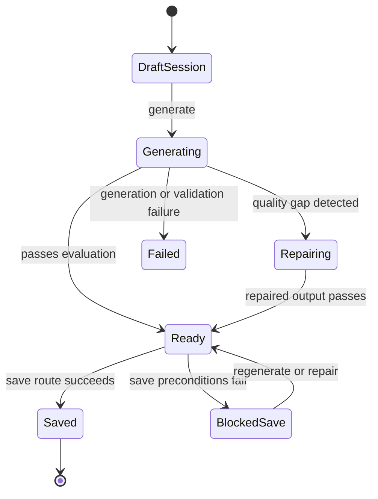

# Dreams

## 1. Purpose and user intent

The Dreams tab generates dream artifacts from recent memory, emotion, relationship, and future tension signals. It is meant to expose subconscious residue and temporary behavioral tilt without directly mutating core personality traits.

## 2. UI entry points and key controls

- Entry point: `DreamJournal` in `src/components/dreams/DreamJournal.tsx`.
- Key controls:
  - dream type selector
  - focus chips for memory, emotion, future, relationship, and conflict
  - user note field
  - generate action
  - save action
  - archive mode for saved dreams
- The UI reads the current provider from `useLLMPreferenceStore` and forwards it in headers.

## 3. End-to-end user workflow

1. Open the Dreams tab.
2. `GET /api/agents/[id]/dream` returns bootstrap data including allowed types, suggested type, defaults, recent sessions, and recent saved dreams.
3. The user creates a session through `POST /api/agents/[id]/dream`.
4. The user generates dream output through `POST /api/agents/[id]/dream/sessions/[sessionId]/generate`.
5. The service evaluates the dream, derives an impression, and stores draft/final records.
6. The user saves the dream through `POST /api/agents/[id]/dream/sessions/[sessionId]/save` if quality conditions pass.

## 4. Backend workflow/pipeline

1. `dreamService.getBootstrap` loads the agent and derives a suggested dream type from current emotional state.
2. `createSession` normalizes note and focus values and enforces the daily limit.
3. `generateSession` builds context from messages, memories, learning signals, journal state, and current emotion.
4. `generateText` produces dream content.
5. The service normalizes scenes, symbols, interpretation, and themes, then validates required fields.
6. `applyFinalQualityGate` evaluates vividness, symbolic coherence, psychological grounding, specificity, clarity, and usefulness.
7. `derive_impression` produces a `DreamImpression` that can influence later chat behavior through `activeDreamImpression`.
8. Session, dream artifacts, and pipeline events are stored through `DreamWorkspaceRepository` or Firestore compatibility writers.
9. `saveSessionDream` blocks saving unless the final dream passes validation and quality checks.

## 5. API contract details

- `GET /api/agents/[id]/dream`
  - returns `DreamBootstrapPayload`.
- `POST /api/agents/[id]/dream`
  - accepts `type`, `userNote`, `focus`.
  - returns `{ session }` with `201`.
- `GET /api/agents/[id]/dream/sessions/[sessionId]`
  - returns `DreamSessionDetail`.
- `POST /api/agents/[id]/dream/sessions/[sessionId]/generate`
  - returns updated `DreamSessionDetail`.
- `POST /api/agents/[id]/dream/sessions/[sessionId]/save`
  - success returns updated `DreamSessionDetail`.
  - blocked save returns `409` with `code: 'dream_save_blocked'`, `blockerReasons`, `qualityStatus`, and validation/evaluation detail.
- Edge cases:
  - the save route returns the blocker payload directly on `409`.
  - the service enforces a daily session cap.

## 6. Data model mapping

- Tables:
  - `dream_sessions`
  - `dreams`
  - `dream_pipeline_events`
  - `agents.activeDreamImpression`
  - `agents.dreamCount`
- Session fields:
  - `status`, `qualityStatus`, `repairCount`, `promptVersion`, `latestStage`, `type`, `normalizedInput`, `contextPacket`, `latestEvaluation`, `finalDreamId`, `provider`, `model`, `failureReason`, `savedAt`
- Dream artifact fields:
  - `status`, `artifactRole`, `normalizationStatus`, `qualityScore`, `sourceDreamId`, `version`, `title`, `summary`, `saved`, `savedAt`
- Dream payload also stores scenes, symbols, themes, interpretation, emotional processing, and derived display metrics.

## 7. State transitions/lifecycle

## 8. Quality gates/validation rules

- Allowed dream types and focus values are enumerated.
- Overall score minimum is `80`; dimension floor is `70`.
- Required dream sections are validated before save.
- Save is blocked by `DreamSaveBlockedError` when the final artifact is unvalidated, under-threshold, or otherwise blocked.

## 9. Failure modes and how they surface in UI/API

- Missing session or agent: `404`.
- Daily session limit: thrown from service and returned as a route failure.
- Generation failure: `500` plus a session `failureReason` and failing pipeline event.
- Save block: `409` with structured blocker details; the UI keeps the draft visible.

## 10. Debugging runbook

1. Inspect bootstrap data to verify suggested type and default note.
2. Inspect `dream_sessions`, `dreams`, and `dream_pipeline_events` for the session.
3. Check `latestEvaluation`, `validation`, and `normalizationStatus` on the final dream.
4. If later chat seems affected incorrectly, inspect `agents.activeDreamImpression` and the originating dream ID.
5. Compare the dream archive with `dreams.saved` if the archive list is wrong.

## 11. Operational checklist

- Verify suggested dream type tracks the current emotional lead.
- Verify generation produces scenes, interpretation, and themes.
- Verify save blocking is explicit and reproducible.
- Verify saved dreams appear in the archive.
- Verify dream impressions do not silently mutate unrelated core fields.

## 12. How to extend safely

- Keep dream sessions and dream artifacts separate; do not collapse them into a single record.
- If you change dream scoring, update UI dimension labels and threshold logic together.
- Treat `activeDreamImpression` as temporary residue, not a permanent personality mutation.

## 13. Code references

- `src/app/api/agents/[id]/dream/route.ts`
- `src/app/api/agents/[id]/dream/sessions/[sessionId]/route.ts`
- `src/app/api/agents/[id]/dream/sessions/[sessionId]/generate/route.ts`
- `src/app/api/agents/[id]/dream/sessions/[sessionId]/save/route.ts`
- `src/lib/services/dreamService.ts`
- `src/lib/repositories/dreamWorkspaceRepository.ts`
- `src/components/dreams/DreamJournal.tsx`
- `src/lib/db/schema.ts`
