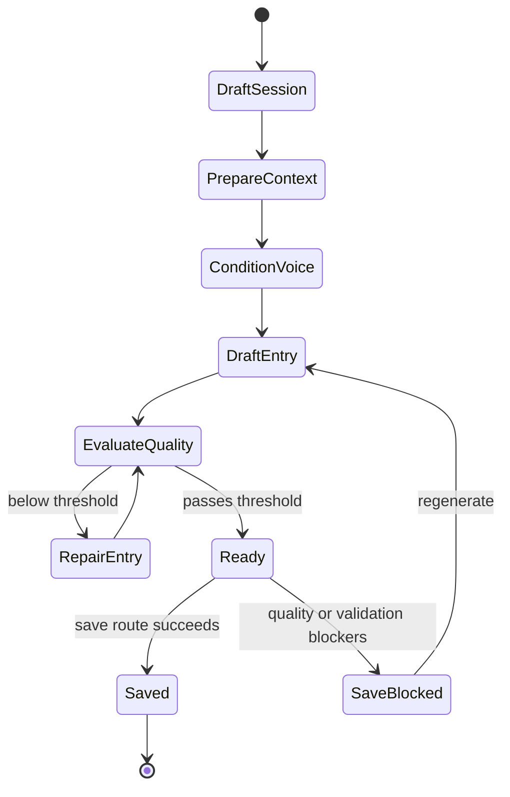

# Journal

## 1. Purpose and user intent

The Journal tab is the private reflection workspace. It drafts self-reflective journal entries using recent memories, goals, relationship context, voice conditioning, and communication fingerprints, then blocks save until the entry passes quality checks.

## 2. UI entry points and key controls

- Entry point: `JournalViewer` in `src/components/journal/JournalViewer.tsx`.
- Key controls:
  - entry type selector
  - focus chips
  - user note field
  - generate button
  - save button
  - archive mode for saved entries
- The UI also surfaces the current pipeline stage, quality status, and any save blockers.

## 3. End-to-end user workflow

1. Open the Journal tab.
2. `GET /api/agents/[id]/journal` returns bootstrap data including defaults, recent sessions, and saved archive entries.
3. The user creates a session with `POST /api/agents/[id]/journal`.
4. The user generates the draft with `POST /api/agents/[id]/journal/sessions/[sessionId]/generate`.
5. The service builds context, conditions voice, drafts the entry, evaluates quality, and may repair the entry.
6. The user saves through `POST /api/agents/[id]/journal/sessions/[sessionId]/save` if blockers are cleared.

## 4. Backend workflow/pipeline

1. `journalService.getBootstrap` loads recent sessions and saved archive entries.
2. `createSession` normalizes type, note, and focus and enforces the daily limit.
3. `generateSession` builds context from memories, messages, relationships, goals, communication fingerprint, emotion, and learning signals.
4. The pipeline stages are:
  - `prepare_context`
  - `condition_voice`
  - `draft_entry`
  - `evaluate_quality`
  - `repair_entry` when needed
  - `ready`
5. The service validates content fields, source refs, and text quality, then runs `applyFinalQualityGate`.
6. It writes session, entry artifacts, and pipeline events through `JournalWorkspaceRepository` or Firestore compatibility writers.
7. `saveSessionEntry` throws `JournalSaveBlockedError` when the final entry is still blocked.

## 5. API contract details

- `GET /api/agents/[id]/journal`
  - returns `JournalBootstrapPayload`.
- `POST /api/agents/[id]/journal`
  - accepts `type`, `userNote`, `focus`.
  - returns `{ session }` with `201`.
- `GET /api/agents/[id]/journal/sessions/[sessionId]`
  - returns `JournalSessionDetail`.
- `POST /api/agents/[id]/journal/sessions/[sessionId]/generate`
  - returns updated `JournalSessionDetail`.
- `POST /api/agents/[id]/journal/sessions/[sessionId]/save`
  - success returns updated detail.
  - blocked save returns `409` with `saveBlockers` containing blocker reasons, quality state, validation, and evaluation.
- Edge cases:
  - the component uses a placeholder detail while generation is in flight.
  - archive entries with `legacy_unvalidated` normalization are intentionally displayed as blocked or legacy rather than trusted output.

## 6. Data model mapping

- Tables:
  - `journal_sessions`
  - `journal_entries`
  - `journal_pipeline_events`
  - `agents.journalCount`
- Session fields:
  - `status`, `qualityStatus`, `repairCount`, `promptVersion`, `latestStage`, `type`, `normalizedInput`, `contextPacket`, `voicePacket`, `latestEvaluation`, `finalEntryId`, `provider`, `model`, `failureReason`, `savedAt`
- Entry fields:
  - `status`, `artifactRole`, `normalizationStatus`, `qualityScore`, `sourceEntryId`, `version`, `title`, `summary`, `saved`, `savedAt`, payload content and render blocks

## 7. State transitions/lifecycle

## 8. Quality gates/validation rules

- Allowed journal types are enumerated in `JOURNAL_TYPES`.
- Focus values are normalized to known `JournalFocus` values only.
- Output is validated for required text fields, source refs, shared artifact text quality, and gate flags.
- Save is blocked if validation fails or quality status is not acceptable.

## 9. Failure modes and how they surface in UI/API

- Daily limit exceeded or session creation failure: route returns `500` with the service error.
- Missing session: detail route returns `404`.
- Save block: `409` with explicit `saveBlockers`; the UI preserves the draft and shows the blocker details.
- Legacy archive entry: rendered as legacy/unvalidated instead of treated as a passed artifact.

## 10. Debugging runbook

1. Inspect `/api/agents/[id]/journal` and `/api/agents/[id]/journal/sessions/[sessionId]`.
2. Inspect `journal_pipeline_events` to find the failing stage.
3. Inspect `journal_entries.validation`, `journal_entries.evaluation`, and `normalizationStatus` for the final artifact.
4. If voice feels wrong, inspect `voicePacket` and `CommunicationFingerprintService` inputs.
5. If context is thin, inspect the selected memories, relationship signals, and goal hints in `contextPacket`.

## 11. Operational checklist

- Verify bootstrap, compose, archive, and detail modes all load.
- Verify stage rail advances correctly during generation.
- Verify save blockers are actionable.
- Verify saved entries appear in the archive and increment the journal counter.

## 12. How to extend safely

- Keep journal pipeline stages explicit; they are used by both the service and UI stage rail.
- If you change entry structure, update renderer expectations in `ChatMessageContent` and archive/detail views.
- Maintain backward compatibility for `legacy_unvalidated` entries until migration is complete.

## 13. Code references

- `src/app/api/agents/[id]/journal/route.ts`
- `src/app/api/agents/[id]/journal/sessions/[sessionId]/route.ts`
- `src/app/api/agents/[id]/journal/sessions/[sessionId]/generate/route.ts`
- `src/app/api/agents/[id]/journal/sessions/[sessionId]/save/route.ts`
- `src/lib/services/journalService.ts`
- `src/lib/repositories/journalWorkspaceRepository.ts`
- `src/components/journal/JournalViewer.tsx`
- `src/lib/db/schema.ts`
