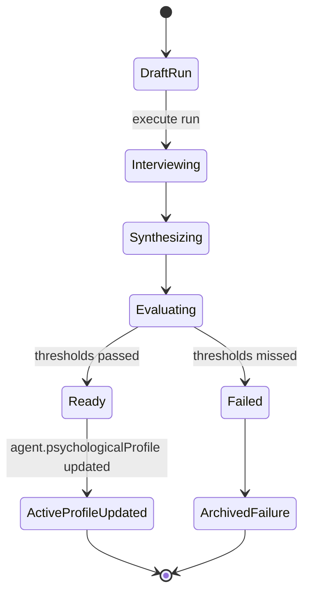

# Profile

## 1. Purpose and user intent

The Profile tab combines two related views: ongoing personality evolution and evidence-backed profile analysis runs. It is the main place to inspect dynamic trait drift, structured interview turns, quality evaluation, and the currently active psychological profile.

## 2. UI entry points and key controls

- Entry point: `ProfileViewer` in `src/components/profile/ProfileViewer.tsx`.
- Main modes:
  - `analysis`
  - `evolution`
  - `communication`
- Key controls:
  - create analysis run
  - execute run with the current provider/model
  - select prior run
  - inspect Big Five, MBTI, Enneagram, and evidence-backed insights

## 3. End-to-end user workflow

1. Open the Profile tab.
2. The component loads `GET /api/agents/[id]/profile` and `GET /api/agents/[id]/profile/evolution`.
3. The user creates a run through `POST /api/agents/[id]/profile/runs`.
4. The user executes that run through `POST /api/agents/[id]/profile/runs/[runId]/execute`.
5. The service gathers evidence, runs a staged interview, synthesizes the profile, evaluates quality, and persists the result.
6. The user reviews the latest profile and can open run detail through `GET /api/agents/[id]/profile/runs/[runId]`.

## 4. Backend workflow/pipeline

1. `profileAnalysisService.getBootstrap` loads the active profile and recent runs.
2. `GET /profile/evolution` reads the current trait state from `AgentService` and recent personality events from `PersonalityEventService`.
3. `createRun` creates a draft `ProfileAnalysisRun`.
4. `executeRun` gathers evidence from messages, memories, communication fingerprints, learning state, and prior events.
5. The interview stage runs through multiple stage blocks such as social style, decision style, stress/conflict, motivation/identity, and communication self-awareness.
6. Stage findings, transcript turns, and pipeline events are persisted through `ProfileAnalysisRepository`.
7. The synthesized `PsychologicalProfile` is normalized, evaluated, and written back to `agents.psychologicalProfile` when accepted.
8. `POST /api/agents/[id]/profile` is a convenience path that regenerates the latest profile and then returns updated bootstrap data.

## 5. API contract details

- `GET /api/agents/[id]/profile`
  - returns `ProfileBootstrapPayload`.
- `POST /api/agents/[id]/profile`
  - body is currently ignored.
  - triggers `regenerateLatestProfile` and returns `{ success, profile, run, bootstrap }`.
- `GET /api/agents/[id]/profile/evolution`
  - returns `coreTraits`, `dynamicTraits`, `totalInteractions`, `lastTraitUpdateAt`, `events`.
- `POST /api/agents/[id]/profile/runs`
  - returns `{ run }` with `201`.
- `GET /api/agents/[id]/profile/runs/[runId]`
  - returns `run`, `interviewTurns`, and `pipelineEvents`.
- `POST /api/agents/[id]/profile/runs/[runId]/execute`
  - returns the same detail payload after execution.
- Edge cases:
  - interview turn payload is duplicated as `prompt` and `response` for component compatibility.
  - the route exposes legacy or failing runs; the UI distinguishes them through `qualityStatus`.

## 6. Data model mapping

- Tables:
  - `agents.psychologicalProfile`
  - `agent_personality_events`
  - `profile_analysis_runs`
  - `profile_interview_turns`
  - `profile_pipeline_events`
- Key run fields:
  - `status`, `qualityStatus`, `qualityScore`, `promptVersion`, `profileVersion`, `latestStage`, `sourceCount`, `transcriptCount`, `provider`, `model`, `completedAt`
- Key profile fields stored inside `agents.psychologicalProfile`:
  - `bigFive`, `mbti`, `enneagram`, `summary`, `confidence`, `source`, `qualityStatus`, `profileVersion`, `claimEvidence`, `strengths`, `challenges`, `triggers`, `growthEdges`
- Evolution reads from `agent_personality_events` or legacy `personality_insight` memories depending on persistence mode.

## 7. State transitions/lifecycle

## 8. Quality gates/validation rules

- Profile analysis enforces minimum overall score, per-dimension floor, and evidence coverage threshold.
- Source refs and shared text fields are validated before final acceptance.
- `normalizePsychologicalProfile` ensures claim-evidence arrays exist for downstream readers.
- Personality evolution events require meaningful trait deltas or supporting indicators.

## 9. Failure modes and how they surface in UI/API

- Missing agent or run: `404` on the relevant route.
- Low evidence coverage or low quality: run is persisted as failed or blocked; the UI shows it as a blocked run instead of a live profile source.
- Communication fingerprint or evidence sparsity: the run can complete but remain weakly grounded.
- Legacy profiles: the active profile can show `legacy_unvalidated`.

## 10. Debugging runbook

1. Inspect bootstrap and evolution payloads separately.
2. Inspect `profile_analysis_runs`, `profile_interview_turns`, and `profile_pipeline_events` for the run.
3. Check `evidenceCoverage`, `latestEvaluation`, and `stageFindings` when a run fails.
4. If the active profile looks stale, verify whether `agents.psychologicalProfile` was actually updated after a passing run.
5. If trait drift looks wrong, inspect `agent_personality_events` and the corresponding chat or memory evidence.

## 11. Operational checklist

- Verify bootstrap and evolution load together.
- Verify run creation and execution succeed end to end.
- Verify interview transcript order is stable.
- Verify only passing runs are presented as the strongest live source.
- Verify trait evolution events align with recent interactions.

## 12. How to extend safely

- Keep deterministic trait evolution separate from LLM-backed profile analysis.
- If you add new interview stages, update stage ordering, persistence, and UI display together.
- If you change profile schema, update `agents.psychologicalProfile`, run payloads, and coverage logic together.

## 13. Code references

- `src/app/api/agents/[id]/profile/route.ts`
- `src/app/api/agents/[id]/profile/evolution/route.ts`
- `src/app/api/agents/[id]/profile/runs/route.ts`
- `src/app/api/agents/[id]/profile/runs/[runId]/route.ts`
- `src/app/api/agents/[id]/profile/runs/[runId]/execute/route.ts`
- `src/lib/services/profileAnalysisService.ts`
- `src/lib/services/psychologicalProfileService.ts`
- `src/lib/services/personalityService.ts`
- `src/lib/services/personalityEventService.ts`
- `src/lib/repositories/profileAnalysisRepository.ts`
- `src/components/profile/ProfileViewer.tsx`
- `src/lib/db/schema.ts`
