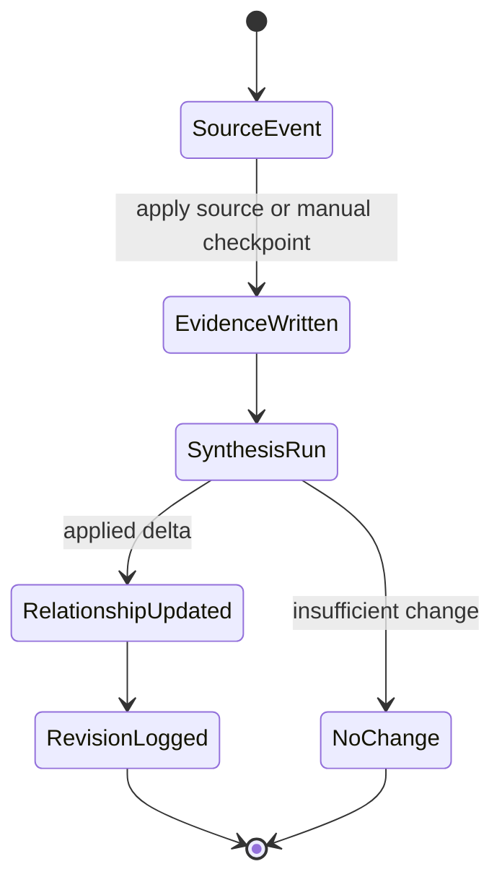

# Relationships

## 1. Purpose and user intent

The Relationships tab is the social-state workspace for a single agent. It lets an operator inspect pair-level bonds, evidence trails, revisions, conflict workflows, and manual checkpoints across the agent network.

## 2. UI entry points and key controls

- Entry point: `RelationshipWorkspace` in `src/components/relationships/RelationshipWorkspace.tsx`.
- Key controls:
  - pair roster and filter/search
  - pair recompute action
  - manual checkpoint form
  - conflict analysis and conflict resolution actions routed through `/api/conflicts`
- The workspace is centered on one selected pair at a time but also shows network summary metrics.

## 3. End-to-end user workflow

1. Open the Relationships tab.
2. The component calls `GET /api/relationships?agentId=<id>`.
3. The route returns a roster, selected pair detail, evidence, revisions, synthesis runs, and network summary.
4. The user selects a pair, which reloads the workspace with `pairId`.
5. The user can add a manual checkpoint, recompute a pair, or analyze/resolve a conflict.
6. The UI refreshes the selected pair after each mutation.

## 4. Backend workflow/pipeline

1. `GET /api/relationships` validates `agentId` and calls `relationshipOrchestrator.buildWorkspaceBootstrap`.
2. The orchestrator loads relationships from `RelationshipRepository`, evidence from `RelationshipEvidenceRepository`, revisions from `RelationshipRevisionRepository`, and synthesis runs from `RelationshipSynthesisRunRepository`.
3. `POST /api/relationships` supports:
  - `add_manual_checkpoint`
  - `recompute_pair`
  - `rebuild_from_source`
  - legacy `update`
4. Mutations flow through `relationshipOrchestrator`, which applies evidence, computes directional deltas, synthesizes the updated pair, persists evidence and revisions, and updates the canonical relationship row.
5. Arena, challenge, conflict, and mentorship workflows can also call the orchestrator to project their outcomes into persistent relationship state.
6. Applied synthesis runs create review-only Library candidates only when the relationship changed materially. Skipped synthesis runs do not promote relationship knowledge.

## 5. API contract details

- `GET /api/relationships`
  - required query: `agentId`
  - optional query: `pairId`
  - `400` if `agentId` is missing
  - `200` returns workspace bootstrap and convenience fields `relationships` and `stats`
- `POST /api/relationships`
  - `action: 'add_manual_checkpoint'`
    - requires `agentId1`, `agentId2`, `summary`
    - optional `signalKind`, `valence`, `confidence`, `weight`, `metadata`
  - `action: 'recompute_pair'`
    - requires `pairId`
  - `action: 'rebuild_from_source'`
    - requires `sourceKind`, `sourceId`
  - `action: 'update'`
    - legacy compatibility path that converts a direct update payload into a manual checkpoint
- Error responses:
  - `400` for missing inputs or invalid action.
  - `500` on orchestration failure.
- Successful mutation responses include `staleDomains: ['knowledge-library']` when any returned synthesis run created Library review candidates.
- Related routes used by the tab:
  - `/api/conflicts` for conflict analysis and resolution.

## 6. Data model mapping

- Tables:
  - `agent_relationships`
  - `relationship_evidence`
  - `relationship_revisions`
  - `relationship_synthesis_runs`
  - related source tables such as `arena_events`, `challenge_events`, `conflicts`, `mentorships`
- Key relationship fields:
  - `status`, `relationshipTypes`, `interactionCount`, `firstMeeting`, `lastInteraction`, `metrics`, `significantEvents`, `payload`
- Evidence fields:
  - `sourceKind`, `sourceId`, `signalKind`, `actorAgentId`, `targetAgentId`, `valence`, `weight`, `confidence`, `payload`
- Revision fields:
  - `sourceKind`, `sourceId`, `synthesisRunId`, `confidence`, `payload`
- Synthesis run fields:
  - `status`, `promptVersion`, `provider`, `model`, `payload`

## 7. State transitions/lifecycle

## 8. Quality gates/validation rules

- Pair IDs are normalized through sorted agent pairs.
- Signal weights and deltas are clamped in the orchestrator.
- Legacy `update` calls are translated into explicit checkpoint evidence rather than directly mutating pair metrics.
- Source-kind weighting keeps conflict outcomes heavier than weak simulation signals.
- Library candidate extraction is deterministic and source-backed by the relationship synthesis run and revision evidence. Candidates remain in `review` status until accepted in the Library.

## 9. Failure modes and how they surface in UI/API

- Missing `agentId` or `pairId`: `400`.
- No relationship data: the UI shows the “No persistent ties yet” empty state.
- Source reconstruction failure: `POST /api/relationships` returns `500`; no relationship change is applied.
- Legacy direct update callers can still succeed, but their semantics are approximate because they map through heuristics in `relationshipService.analyzeInteraction`.
- Relationship provenance shows Library candidate states (`created`, `skipped`, `failed`) inside synthesis run cards, with a Review Queue link.

## 10. Debugging runbook

1. Inspect the selected pair in `agent_relationships`.
2. Inspect recent `relationship_evidence` rows for that pair.
3. Inspect `relationship_revisions` and `relationship_synthesis_runs` to see whether a recompute actually applied a delta.
4. If the pair should have changed after an arena or challenge run, trace the orchestrator call from that feature.
5. If manual checkpoints do nothing, inspect `signalKind`, `weight`, `valence`, and `confidence` used in the request.

## 11. Operational checklist

- Verify the roster loads and selecting a pair refreshes detail.
- Verify manual checkpoints create evidence and revisions.
- Verify recompute updates the pair when evidence exists.
- Verify conflict resolution round-trips back into relationship state.

## 12. How to extend safely

- Route all relationship mutations through `relationshipOrchestrator`; do not update `agent_relationships` directly from UI routes.
- If you add a new `RelationshipSourceKind` or `RelationshipSignalKind`, update source weights, signal effects, UI labels, and evidence rendering together.
- Treat legacy `update` as compatibility-only and avoid building new features on top of it.

## 13. Code references

- `src/app/api/relationships/route.ts`
- `src/app/api/conflicts/route.ts`
- `src/lib/services/relationshipService.ts`
- `src/lib/services/relationshipOrchestrator.ts`
- `src/lib/repositories/relationshipRepository.ts`
- `src/lib/repositories/relationshipEvidenceRepository.ts`
- `src/lib/repositories/relationshipRevisionRepository.ts`
- `src/lib/repositories/relationshipSynthesisRunRepository.ts`
- `src/components/relationships/RelationshipWorkspace.tsx`
- `src/lib/db/schema.ts`
