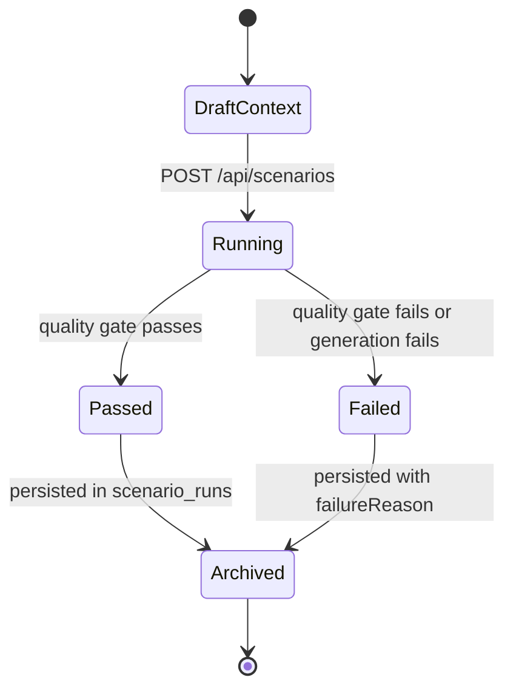

# Scenarios

## 1. Purpose and user intent

The Scenarios tab is the workspace for alternate-trajectory probes. It lets an operator choose a branch point from message, memory, relationship, or simulation history, apply an intervention, and compare baseline versus alternate outcomes.

## 2. UI entry points and key controls

- Entry point: `ParallelRealityExplorer` in `src/components/parallel/ParallelRealityExplorer.tsx`.
- Key controls:
  - branch point selector
  - intervention template selector and editor
  - run trigger
  - archive/recent run viewer
  - quality and comparison panels for an active run
- The page manages selected branch point, selected intervention, active run, and running state in `src/app/agents/[id]/page.tsx`.

## 3. End-to-end user workflow

1. Open the Scenarios tab.
2. The page calls `GET /api/scenarios?agentId=<id>` to load branch points, intervention templates, recent runs, and analytics.
3. The user selects a branch point and either chooses or edits an intervention.
4. The UI sends `POST /api/scenarios` with `agentId`, `branchPointId`, `branchPointKind`, `intervention`, and optional `maxTurns`.
5. The service runs the alternate path and returns a `scenarioRun`.
6. The user can reopen any prior run through `GET /api/scenarios/[id]`.

## 4. Backend workflow/pipeline

1. `ScenarioService.getScenarioLabBootstrap` gathers branch points from messages, memories, relationships, and simulations.
2. The route returns prebuilt intervention templates and analytics.
3. `ScenarioService.runScenario` assembles branch context from:
  - recent messages from `MessageService`
  - relevant memories from `MemoryService`
  - learning adaptations from `LearningService`
  - relationships from `RelationshipRepository` or Firestore
  - emotional baseline from `emotionalService`
4. The service generates baseline and alternate turns, validates them, and runs `applyFinalQualityGate`.
5. The resulting `ScenarioRunRecord` is upserted through `ScenarioRunRepository` or Firestore `scenario_runs`.
6. `ScenarioService.getScenarioRunById` rehydrates a stored run for replay.

## 5. API contract details

- `GET /api/scenarios?agentId=<id>`
  - `400` when `agentId` is missing.
  - `404` when the agent is missing.
  - `200` with bootstrap data from `ScenarioService.getScenarioLabBootstrap`.
- `POST /api/scenarios`
  - required body fields:
    - `agentId`
    - `branchPointId`
    - `branchPointKind`
    - `intervention`
  - optional: `maxTurns`
  - success: `200` with `{ scenarioRun: ScenarioRunRecord }`
- `GET /api/scenarios/[id]`
  - returns `{ scenarioRun }`
  - `404` if the run is missing.
- Edge cases:
  - quality gating can mark the run as failed even if a model reply was generated.
  - relationship branch points depend on existing relationship events; no pair history means fewer scenario options.

## 6. Data model mapping

- Primary table: `scenario_runs`.
- Key columns:
  - `agentId`, `status`, `qualityStatus`, `qualityScore`, `failureReason`, `promptVersion`, `branchKind`, `branchRefId`, `createdAt`, `updatedAt`, `payload`
- Stored payload contains:
  - `branchPoint`
  - `intervention`
  - `probeSet`
  - `branchContext`
  - `baselineState`
  - `alternateState`
  - `turns`
  - `comparison`
  - `validation`, `evaluation`, `sourceRefs`, `metadata`
- Read-only source tables for branch generation:
  - `messages`
  - `memories`
  - `agent_relationships`
  - `simulations`
  - learning tables

## 7. State transitions/lifecycle

## 8. Quality gates/validation rules

- The route validates presence of all core run inputs.
- The scenario service applies leakage checks, source-ref validation, and a final quality evaluation.
- Constants enforce minimum overall and per-dimension quality thresholds.
- Probe response heuristics reject filler, PM jargon, meta-roleplay leakage, and underspecified outputs.

## 9. Failure modes and how they surface in UI/API

- Missing branch input: `400`.
- Agent or run missing: `404`.
- Quality gate failure: run is stored with `qualityStatus: failed` and a `failureReason`; the UI shows the run as blocked.
- Sparse context: alternate path still runs, but comparison quality may degrade because branch context is thin.

## 10. Debugging runbook

1. Inspect the bootstrap payload and confirm the expected branch point appears.
2. Inspect the stored `scenario_runs.payload.branchContext` to verify messages, memories, and adaptations were loaded.
3. Inspect `validation`, `evaluation`, `qualityFlags`, and `repair` fields on stored turns.
4. If relationship-based branches look wrong, inspect the underlying pair in `agent_relationships` and recent revisions.

## 11. Operational checklist

- Verify each branch-point source family contributes entries.
- Verify interventions round-trip through the editor without dropping fields.
- Verify passed versus blocked runs are clearly distinguishable.
- Verify recent runs reopen correctly through `/api/scenarios/[id]`.

## 12. How to extend safely

- Add new branch point types only if you can also provide stable source refs and comparison logic.
- Keep intervention schema changes synchronized between `ParallelRealityExplorer`, route typing, and `ScenarioRunRecord`.
- Avoid writing live agent state from a scenario run; scenarios are projections, not canonical mutations.

## 13. Code references

- `src/app/agents/[id]/page.tsx`
- `src/app/api/scenarios/route.ts`
- `src/app/api/scenarios/[id]/route.ts`
- `src/lib/services/scenarioService.ts`
- `src/lib/repositories/scenarioRunRepository.ts`
- `src/components/parallel/ParallelRealityExplorer.tsx`
- `src/components/parallel/ScenarioGuideModal.tsx`
- `src/lib/db/schema.ts`
