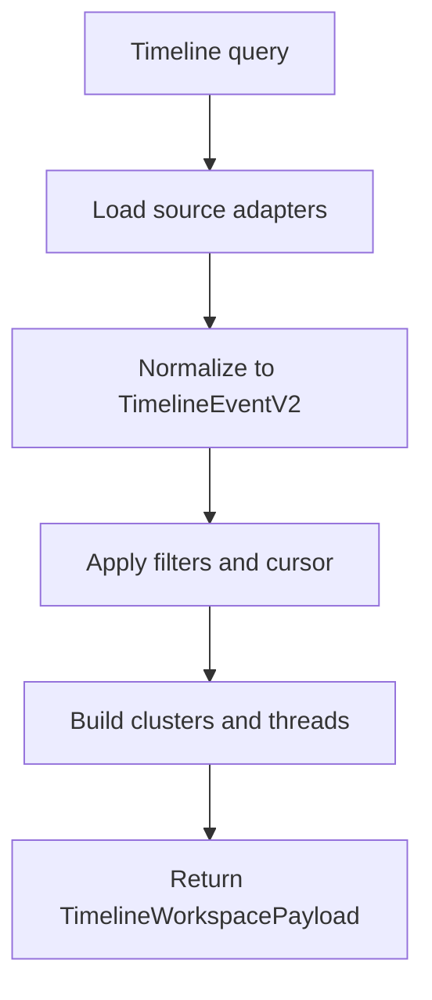

# Timeline

## 1. Purpose and user intent

The Timeline tab is the cross-section audit trail for an agent. It merges chat, memory, emotion, relationship, dream, journal, creative, profile, scenario, challenge, arena, learning, mentorship, Knowledge Library, and legacy knowledge records into one chronological workspace.

## 2. UI entry points and key controls

- Entry point: `TimelineExplorer` in `src/components/timeline/TimelineExplorer.tsx`.
- Query controls: text search, source toggles, quality filter, load-more pagination cursor, and event selection.
- Readouts: source coverage strip, metrics, clustered events, theme threads, and event detail cards.

## 3. End-to-end user workflow

1. Open the Timeline tab.
2. The component calls `GET /api/agents/[id]/timeline` with the active filter set.
3. The route parses the query and asks `timelineService.getWorkspace` for a merged event payload.
4. The service loads each feature source, normalizes them into `TimelineEventV2`, and builds threads, clusters, and source coverage.
5. The UI renders the filtered timeline and lets the operator inspect a single event in more detail.

## 4. Backend workflow/pipeline

1. `timelineService.parseQuery` reads date range, cursor, source types, query string, importance floor, quality filter, and limit.
2. `timelineService.getWorkspace` loads the agent and then queries source repositories.
3. Repository reads include:
  - `MessageRepository`
  - `MemoryRepository`
  - `DreamWorkspaceRepository`
  - `JournalWorkspaceRepository`
  - `CreativeStudioRepository`
  - `RelationshipRevisionRepository`
  - `PersonalityEventRepository`
  - `ScenarioRunRepository`
  - `ChallengeLabRepository`
  - `ArenaRepository`
  - `LearningRepository`
  - `MentorshipRepository`
  - `KnowledgeRepository`
  - `LibraryRepository`
  - `BroadcastRepository`
4. Source adapters convert each record family into `TimelineEventV2`.
5. The knowledge adapter emits Library item state events, Library validation lifecycle events, Library-backed Collective broadcasts, legacy shared knowledge events, and legacy broadcasts.
6. The service filters with `passesQuery`, then builds `threads`, `clusters`, metrics, and `sourceCoverage`.
7. The route returns `TimelineWorkspacePayload`.

## 5. API contract details

- `GET /api/agents/[id]/timeline`
- Query params handled by `parseQuery`:
  - `q`
  - `types`
  - `from`
  - `to`
  - `cursor`
  - `minImportance`
  - `quality`
  - `limit`
- Success response:
  - `200` with `TimelineWorkspacePayload` including `events`, `threads`, `clusters`, `filters`, `sourceCoverage`, and summary metrics.
- Error response:
  - `404` when the agent is missing.
  - `500` when any unhandled workspace build error escapes.
- Edge cases:
  - A source can return zero events without failing the timeline.
  - Coverage explicitly reports degraded or empty sources.

## 6. Data model mapping

- Timeline is read-only and spans many tables.
- Primary table families read:
  - `messages`
  - `memories`
  - `dream_sessions`, `dreams`, `dream_pipeline_events`
  - `journal_sessions`, `journal_entries`, `journal_pipeline_events`
  - `creative_sessions`, `creative_artifacts`, `creative_pipeline_events`
  - `agent_personality_events`
  - `relationship_revisions`
  - `scenario_runs`
  - `challenge_runs`, `challenge_events`, `challenge_participant_results`
  - `arena_runs`, `arena_events`
  - `learning_patterns`, `learning_goals`, `learning_adaptations`, `learning_events`, `learning_observations`, `skill_progressions`
  - `mentorships`
  - `library_items`, `library_item_sources`, `library_item_validations`
  - `shared_knowledge`
  - `collective_broadcasts`
- Derived event fields:
  - `importance`, `themes`, `qualityStatus`, `participants`, `sourceRefs`, `relatedRefs`

## 7. State transitions/lifecycle

## 8. Quality gates/validation rules

- Query limit is clamped between the service default and max.
- Quality filtering is explicit and uses `qualityStatus` when present.
- Importance is normalized into a stable 1-10 range for cross-source comparison.

## 9. Failure modes and how they surface in UI/API

- Agent missing: `404`.
- One noisy source: timeline can still render if the service catches and marks coverage as degraded.
- Missing quality fields on older records: those events appear as `unknown` or `legacy_unvalidated` depending on source data.
- Timeline drift: if a new feature table is added without a source adapter, the timeline will silently omit it.
- Library lifecycle drift: if a Library mutation writes item state without a validation event, Timeline will show the item state but not the decision rationale.

## 10. Debugging runbook

1. Hit `/api/agents/[id]/timeline` without filters and inspect `sourceCoverage`.
2. Verify the source repository directly when one category is empty. For Library knowledge, inspect `library_items`, `library_item_sources`, and `library_item_validations`.
3. Check the normalized event payload for bad timestamps or missing `qualityStatus`.
4. If clustering looks wrong, inspect event `themes` generated by the relevant adapter.
5. If pagination repeats events, compare `cursor` handling against event timestamps.

## 11. Operational checklist

- Verify each major source family contributes events.
- Verify Library accept/reject/dispute/resolve/retire/merge/broadcast events appear in the knowledge source.
- Verify source coverage reflects empty versus degraded states accurately.
- Verify filters update event counts and visible sources.
- Verify timeline detail cards open the expected event.

## 12. How to extend safely

- Add new source adapters in `timelineService` when you add a new persisted feature family.
- Reuse normalized `TimelineEventV2` fields instead of adding source-specific UI branches in the component.
- Keep cross-source scoring deterministic so older events remain comparable.

## 13. Code references

- `src/app/api/agents/[id]/timeline/route.ts`
- `src/lib/services/timelineService.ts`
- `src/components/timeline/TimelineExplorer.tsx`
- `src/lib/repositories/messageRepository.ts`
- `src/lib/repositories/memoryRepository.ts`
- `src/lib/repositories/dreamWorkspaceRepository.ts`
- `src/lib/repositories/journalWorkspaceRepository.ts`
- `src/lib/repositories/creativeStudioRepository.ts`
- `src/lib/repositories/relationshipRevisionRepository.ts`
- `src/lib/repositories/personalityEventRepository.ts`
- `src/lib/repositories/scenarioRunRepository.ts`
- `src/lib/repositories/challengeLabRepository.ts`
- `src/lib/repositories/arenaRepository.ts`
- `src/lib/repositories/learningRepository.ts`
- `src/lib/repositories/mentorshipRepository.ts`
- `src/lib/repositories/knowledgeRepository.ts`
- `src/lib/repositories/libraryRepository.ts`
- `src/lib/repositories/broadcastRepository.ts`
- `src/lib/db/schema.ts`
